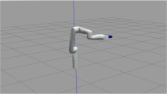

**Please follow the below commands to Install ROS Noetic with Turtlebot3:**
1. Copy paste the "install_ros.sh" file to your home directory
2. Open terminal in your home directory
3. Write the following commands:
  - `chmod +x install_ros.sh`
  - `./install_ros.sh`
4. Run the command to check the ROS version:
   `rosversion ros`  
  
Note: Follow the same commands for installing Fetch and Kinova packages also, just use the file names "install_kortex.sh" for Kinova nd "install_fetch.sh" for Fetch packages. All, the packages are for ROS Noetic only.
   
# Test Commands
## Turtlebot

## Kinova Arms
`roslaunch kortex_gazebo spawn_kortex_robot.launch arm:=gen3_lite z0:=0.8`
- Attempt to add MotionPlanning (bottom left) in RVIZ.
- Arm should look like this in Gazebo:

- Adjusting the movement handles and selecting "Plan and Execute" in RVIZ should cause the arm to move in Gazebo.

## Fetch
